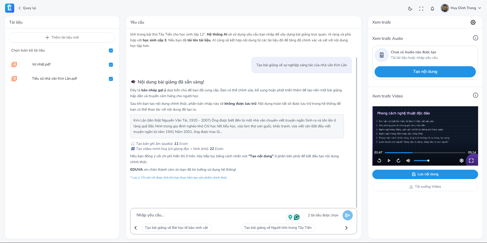

<h1 align="center">Eduva Backend</h1>
<p align="center">
    
</p>
<p align="center">
    Backend for AI-Powered Learning Material Management System with Automated Audio/Video Lesson Generation for High School Teachers
</p>

<a name="table-of-contents"></a>

## Table of Contents

- [Table of Contents](#table-of-contents)
- [Description](#description)
- [Installation](#installation)
  - [Requirements](#requirements)
  - [Clone the Project](#clone-the-project)
  - [Environment Setup](#environment-setup)
  - [Running the Application](#running-the-application)
- [Project Structure](#project-structure)
- [TODO](#todo)
- [License](#license)

<a name="description"></a>

## Description

Eduva Backend is the core service for the AI-powered learning material management system. It provides APIs and backend logic for managing educational content, automating the generation of audio/video lessons, and supporting high school teachers in their teaching process.



<a name="installation"></a>

## Installation

<a name="requirements"></a>

### Requirements

- .NET 8.0 SDK (for backend)
- PostgreSQL (database, required for backend)
- Redis (cache, required for backend)
- RabbitMQ (message broker, required for backend)
- Azure Blob Storage (for file storage, required for backend)
- Docker & Docker Compose (optional, for local development and deployment)

<a name="clone-the-project"></a>

### Clone the Project

```bash
git clone https://github.com/tranduckhuy/eduva-backend.git
cd eduva-backend/backend
```

<a name="environment-setup"></a>

### Environment Setup

See [documents/environment-setup.md](documents/environment-setup.md) for detailed environment configuration and setup instructions.

<a name="running-the-application"></a>

### Running the Application

```bash
cd backend/src/Eduva.API
dotnet restore
dotnet build
dotnet run
```

<a name="project-structure"></a>

## Project Structure

```
backend/
  src/
    Eduva.API/           # API project
    Eduva.Application/   # Application logic
    Eduva.Domain/        # Domain models
    Eduva.Infrastructure/# Infrastructure and data access
    Eduva.Shared/        # Shared resources
  tests/                 # Unit and integration tests
```

<a name="todo"></a>

## TODO

- [ ] Implement more AI-powered features

<a name="license"></a>

## License
